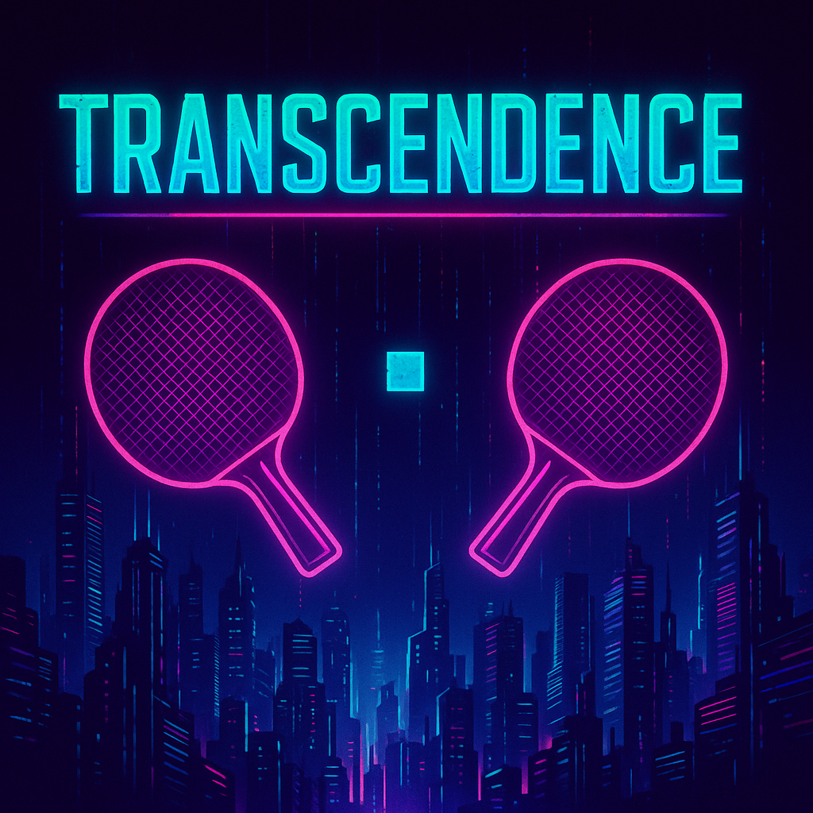

[![Contributors][contributors-shield]][contributors-url]
[![Commits][commits-shield]][commits-url]

<!-- PROJECT LOGO -->
 

  

  <h3 align="center">ft_transcendence</h3>

  

    The final 42 Common Core school project
     
    A web app to play Pong tournaments with friends, built with Docker and secure login.
  

<!-- TABLE OF CONTENTS -->

  
Table of Contents

  <ol>
    <li>
      <a href="#about-the-project">About The Project</a></li>
      <li><a href="#built-with">Built With</a></li>
      <!-- <ul>
      </ul>
    <li>
      <a href="#getting-started">Getting Started</a>
      <ul>
        <li><a href="#prerequisites">Prerequisites</a></li>
        <li><a href="#installation">Installation</a></li>
      </ul>
    </li> -->
    <!-- <li><a href="#usage">Usage</a></li> -->
    <li><a href="#roadmap">Roadmap</a></li>
    <!-- <li><a href="#contact">Contact</a></li> -->
    <li><a href="#resources">Resources</a></li>
  </ol>

<!-- ABOUT THE PROJECT -->
## About The Project

<!-- [![Product Name Screen Shot][product-screenshot]](https://example.com) -->

This project is a web version of the classic Pong game, with extra features.  
For the mandatory part it should include:

* A web app where two players can play Pong on the same keyboard
* A tournament system to register players and show match brackets
* User login and registration with secure password storage
* A clean single-page layout (SPA) using TypeScript
* Everything runs inside Docker containers

Bonus features are:
* Remote multiplayer over the internet
* AI-controlled opponents
* Live chat between players
* A web firewall (WAF) and secret management with Vault
* Monitoring, logging, and dockerized microservices

Let's see what we'll implement to our transcendence web app.

(<a href="#readme-top">back to top</a>)

### Built With

Here are a few examples.

#### Frontend
  * Must be a Single Page Application (SPA)
  * Written in Typescript
  * We may use frontend frameworks/libraries like React, Tailwind CSS, etc.

[![Typescript][Typescript]][Typescript-url]  [![React][React.js]][React-url]  [![Tailwind CSS][TailwindCSS]][TailwindCSS-url]

#### Backend
  * By default: written in pure PHP, no framework allowed
  * Exception: If we choose the Fastify module, we can write the backend in Node.js using Fastify

#### Game Logic	
  * JS (frontend)
  * PHP or Node (backend)	
  * Keep logic simple, no engines

(<a href="#readme-top">back to top</a>)

<!-- ROADMAP -->
## Roadmap

See the [open issues](https://github.com/RubenPin90/ft_transcendence/issues) for a full list of proposed features (and known issues).

(<a href="#readme-top">back to top</a>)

<!-- CONTACT
## Contact

Your Name - [@your_twitter](https://twitter.com/your_username) - email@example.com

Project Link: [https://github.com/your_username/repo_name](https://github.com/your_username/repo_name)

(<a href="#readme-top">back to top</a>)
 -->

<!-- ACKNOWLEDGMENTS -->
## Resources

List resources that might be helpful:

* [42 Subject](https://github.com/RubenPin90/ft_transcendence/resources/en.subject_transcendence.pdf)

(<a href="#readme-top">back to top</a>)

<!-- MARKDOWN LINKS & IMAGES -->
<!-- https://www.markdownguide.org/basic-syntax/#reference-style-links -->
[contributors-shield]: https://img.shields.io/badge/Contributors-blue?style=for-the-badge
[contributors-url]: https://github.com/RubenPin90/ft_transcendence/graphs/contributors
[commits-shield]: https://img.shields.io/badge/Commits-yellow?style=for-the-badge
[commits-url]: https://github.com/RubenPin90/ft_transcendence/graphs/commit-activity

[product-screenshot]: images/screenshot.png
[Next.js]: https://img.shields.io/badge/next.js-000000?style=for-the-badge&logo=nextdotjs&logoColor=white
[Next-url]: https://nextjs.org/

[React.js]: https://img.shields.io/badge/React-20232A?style=for-the-badge&logo=react&logoColor=61DAFB
[React-url]: https://reactjs.org/

[TailwindCSS]: https://img.shields.io/badge/Tailwind_CSS-20232A?style=for-the-badge&logo=tailwind%20CSS&logoColor=61DAFB
[TailwindCSS-url]: https://tailwindcss.com/

[Typescript]: https://img.shields.io/badge/Typescript-white?style=for-the-badge&logo=Typescript
[Typescript-url]: https://www.typescriptlang.org/

